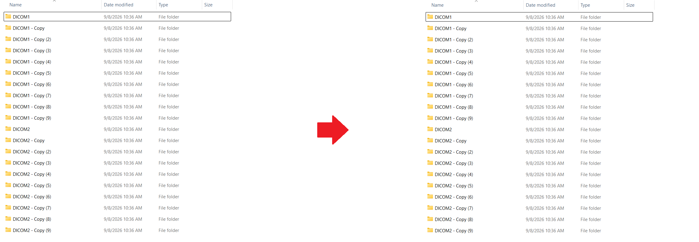

.. _dcm_sort:

DICOM Sort (`dcm_sort`)
=======================
Sort DICOM files by study series (used for flat directory structures)

**Usage**::

	dcm_sort <DICOM_directory>

.. list-table:: Options
   :widths: 15 85
   :header-rows: 1

   * - Flag
     - Description
   * - ``-c``
     - Copy files (default symbolically link)
   * - ``-d``
     - Verbose debug mode
   * - ``-e<ext>``
     - Take files with specified extension
   * - ``-i``
     - Take files with integer filenames
   * - ``-p<str>``
     - Take files only with DICOM field 'PAT Patient Name' matching specified string
   * - ``-r<str>``
     - Take files with filenames containing specified string
   * - ``-t``
     - Toggle OFF use of -t in call to dcm_dump_file

.. important::	dcm_sort removes existing single study subdirectories

.. important::	dcm_sort puts unclassifiable DICOMs into subdirectory study0

**Examples**::

	dcm_sort /path/to/DICOM_dir
	dcm_sort /path/to/DICOM_dir -p930589002 -c

